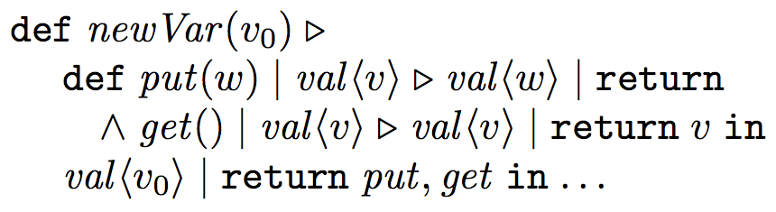

[](https://gitter.im/joinrun-scala/Lobby?utm_source=badge&utm_medium=badge&utm_campaign=pr-badge&utm_content=badge)
[](https://travis-ci.org/Chymyst/joinrun-scala)
[](https://codecov.io/gh/Chymyst/joinrun-scala?branch=master)
[](https://opensource.org/licenses/Apache-2.0)
[](https://github.com/Chymyst/joinrun-scala/tags)
[](http://search.maven.org/#search%7Cga%7C1%7Cio.chymyst)

# `Chymyst` -- declarative concurrency in Scala

This repository hosts `Chymyst Core` -- a library that provides a Scala domain-specific language for declarative concurrency.
[`Chymyst`](https://github.com/Chymyst/Chymyst) is a framework-in-planning that will build upon `Chymyst Core` to enable creating concurrent applications declaratively.

`Chymyst` is based on the **chemical machine** paradigm, known in the academic world as [Join Calculus (JC)](https://en.wikipedia.org/wiki/Join-calculus).
JC has the same expressive power as CSP ([Communicating Sequential Processes](https://en.wikipedia.org/wiki/Communicating_sequential_processes)) and [the Actor model](https://en.wikipedia.org/wiki/Actor_model), but is easier to use.
(See also [Conceptual overview of concurrency](https://chymyst.github.io/joinrun-scala/concurrency.html).)

The initial code of `Chymyst Core` was based on previous work by Jiansen He (https://github.com/Jiansen/ScalaJoin, 2011) and Philipp Haller (http://lampwww.epfl.ch/~phaller/joins/index.html, 2008), as well as on earlier prototypes in [Objective-C/iOS](https://github.com/winitzki/CocoaJoin) and [Java/Android](https://github.com/winitzki/AndroJoin).

The current implementation is tested under Oracle JDK 8 with Scala `2.11.8` and `2.12.1`.

[Version history and roadmap](https://chymyst.github.io/joinrun-scala/roadmap.html)

# Overview of `Chymyst` and the chemical machine paradigm

To get started, begin with this [tutorial introduction](https://chymyst.github.io/joinrun-scala/chymyst00.html).

I presented an early version of `Chymyst Core`, at that time called `JoinRun`, at [Scalæ by the Bay 2016](https://scalaebythebay2016.sched.org/event/7iU2/concurrent-join-calculus-in-scala). See the [talk video](https://www.youtube.com/watch?v=jawyHGjUfBU) and these [talk slides revised for the current syntax](https://github.com/winitzki/talks/raw/master/join_calculus/join_calculus_2016_revised.pdf).

There is some [technical documentation for the core library](docs/chymyst-core.md).

A complete minimal "Hello, world" project can be found at [https://github.com/Chymyst/helloworld](https://github.com/Chymyst/helloworld)

# Main features of `Chymyst`

`Chymyst` implements Join Calculus similarly to [JoCaml](http://jocaml.inria.fr), with some extensions in both syntax and semantics.

## Concise declarative syntax 

`Chymyst Core` provides an embedded Scala DSL for chemical machine definitions.
Example code looks like this:

```scala
import io.chymyst.jc._

val s = m[Int] // declare a non-blocking molecule s
val c = b[Int, Int] // declare a blocking molecule c
site( // declare a reaction site
  go { case s(x) + c(y, reply) =>
    s(x + y) + reply(x)
  }
)
s(1) // emit non-blocking molecule s with value 1

```

As a baseline reference, the most concise syntax for JC is available in [JoCaml](http://jocaml.inria.fr), which uses a modified OCaml compiler.
The equivalent reaction definition in JoCaml looks like this:

```ocaml
def s(x) & c(y) =  // declare a reaction site as well as molecules s and c
   s(x + y) & reply x to c
spawn s(1)  // emit non-blocking molecule s with value 1

```

In the JoCaml syntax, `s` and `c` are declared implicitly, together with the reaction, and type inference fixes the types of their values.
Implicit declaration of molecule emitters (“channels”) is not possible in `Chymyst` because Scala macros cannot insert new top-level name declarations into the code.
For this reason, `Chymyst` requires explicit declarations of molecule types (for example, `val c = b[Int, Int]`).

## Arbitrary input patterns

In `Chymyst`'s Scala DSL, a reaction's input patterns is a `case` clause in a partial function.
Within the limits of the Scala syntax, reactions can define arbitrary input patterns.
 
- Reactions can use pattern matching expressions as well as guard conditions for selecting molecule values:

```scala
val c = m[Option[Int]]
val d = m[(String, List[String])]

go { case c(Some(x)) + d( s@("xyz", List(p, q, r)) ) 
      if x > 0 && p.length > q.length =>
      // Reaction will start only if the condition holds.
      // Reaction body can use pattern variables x, s, p, q, r.
}

```

- Reactions can use repeated input molecules ("nonlinear patterns"):

```scala
val c = m[Int]

go { case c(x) + c(y) if x > y => c(x - y) }

```

Some concurrent algorithms are more easily expressed using repeated input molecules.

- A reaction can consume any number of blocking molecules at once, and each blocking molecule will receive its own reply.

For example, here is a reaction that consumes 3 blocking molecules `f`, `f`, `g` and exchanges the values caried by the two `f` molecules:

```scala
val f = b[Int, Int]
val g = b[Unit, Unit]

go { case f(x1, replyF1) + f(x2, replyF2) + g(_, replyG) =>
   replyF1(x2) + replyF2(x1) + replyG()
}

```

This reaction is impossible to write using JoCaml-style syntax `reply x to f`:
in that syntax, we cannot identify which of the copies of `f` should receive which reply value.
We can do this in JoCaml:

```ocaml
def f(x1) + f(x2) + g() =>
  reply x2 to f; reply x1 to f; reply () to g

```

However, this does not specify that the reply value `x2` should be sent to the process that emitted `f(x1)` rather than to the process that emitted `f(x2)`.

## Reactions are values

Reactions are not merely `case` clauses but locally scoped values (instances of class `Reaction`):

```scala
val c = m[Int]
val reaction = go { case c(x) => println(x) }
// Declare a reaction, but do not run anything yet.

```

Users can build reaction sites incrementally, constructing, say, an array of `n` reaction values, where `n` is a run-time parameter.
Then a reaction site can be declared, using the array of reaction values:

```scala
val reactions: Seq[Reaction] = ???
site(reactions: _*)

```

Since molecule emitters are local values, one can also define `n` different molecules, where `n` is a run-time parameter.
There is no limit on the number of reactions in one reaction site, and no limit on the number of different molecules. 

Nevertheless, reactions and reaction sites are immutable once declared.

## Timeouts for blocking molecules

Emitting a blocking molecule will block forever if no reactions can consume that molecule.
Users can decide to time out on that blocking call:

```scala
val f = b[Unit, Int]

site(...) // define some reactions that consume f

val result: Option[Int] = f.timeout()(200 millis)
// will return None on timeout

```

## Static analysis for correctness and optimization

`Chymyst` uses macros to perform extensive static analysis of reactions at compile time.
This allows `Chymyst` to detect some errors such as deadlock or livelock, and to give warnings for possible deadlock or livelock, before any reactions are started.

```scala
val a = m[Int]
val c = m[Unit]

site( go { case a(x) => c() + a(x+1) } )
// Does not compile: "Unconditional livelock due to a(x)"

```

The static analysis also enforces constraints such as the uniqueness of the reply to blocking molecules.

Common cases of invalid chemical definitions are flagged either at compile time, or as run-time errors that occur after defining a reaction site and before starting any processes.
Other errors are flagged when reactions are run (e.g. if a blocking molecule gets no reply but static analysis was unable to determine that).

The results of static analysis are used to optimize the scheduling of reactions at runtime.
For instance, reactions that impose no cross-molecule conditions are scheduled significantly faster.

## Thread pools

`Chymyst` implements fine-grained threading control.
Each reaction site and each reaction can be run on a different, separate thread pool if required.
The user can control the number of threads in thread pools.

```scala
val tp1 = new FixedPool(1)
val tp8 = new SmartPool(8)

site(tp8)( // reaction site runs on tp8
  go { case a(x) => ... } onThreads tp1, // this reaction runs on tp1
  go { ... } // all other reactions run on tp8
 )

```

Thread pools are "smart" because they will automatically adjust the number of active threads if blocking operations occur.
So, blocking operations do not decrease the degree of parallelism.

## Graceful shutdown

When a `Chymyst`-based program needs to exit, it can shut down the thread pools that run reactions.

```scala
val tp = new SmartPool(8)

// define reactions and run them

tp.shutdownNow() // all reactions running on `tp` will stop

```

## Fair nondeterminism

Whenever a molecule can start several reactions, the reaction is chosen at random.

## Fault tolerance

Reactions marked as fault-tolerant will be automatically restarted if exceptions are thrown.

## Debugging

The execution of reactions can be traced via logging levels per reaction site.
Due to automatic naming of molecules and static analysis, debugging can print information about reaction flow in a visual way.

## Comparison: chemical machine vs. academic Join Calculus

In talking about `Chymyst`, I follow the chemical machine metaphor and terminology, which differs from the terminology usually found in academic papers on JC.
Here is a dictionary:

| Chemical machine  | Academic Join Calculus | `Chymyst` code |
|---|---|---|
| input molecule | message on channel | `case a(123) => ...` _// pattern-matching_ |
| molecule emitter | channel name | `val a :  M[Int]` |
| blocking emitter | synchronous channel | `val q :  B[Unit, Int]` |
| reaction | process | `val r1 = go { case a(x) + ... => ... }` |
| emitting an output molecule | sending a message | `a(123)` _// side effect_ |
| emitting a blocking molecule | sending a synchronous message | `q()` _// returns Int_ |
| reaction site | join definition | `site(r1, r2, ...)` |

As another comparison, here is some code in academic Join Calculus, taken from [this tutorial](http://research.microsoft.com/en-us/um/people/fournet/papers/join-tutorial.pdf):



This code creates a shared value container `val` with synchronized single access.

The equivalent `Chymyst` code looks like this:

```scala
def newVar[T](v0: T): (B[T, Unit], B[Unit, T]) = {
  val put = b[T, Unit] 
  val get = b[Unit, T]
  val _val = m[T] // Will use the name `_val` since `val` is a Scala keyword.
  
  site(
    go { case put(w, ret) + _val(v) => _val(w); ret() },
    go { case get(_, ret) + _val(v) => _val(v); ret(v) }
  )
  _val(v0)
  
  (put, get)
}

```

# Example: "dining philosophers"

This is a complete runnable example.

```scala
import io.chymyst.jc._

object Main extends App {
   /**
   * Print message and wait for a random time interval.
   */
  def wait(message: String): Unit = {
    println(message)
    Thread.sleep(scala.util.Random.nextInt(20))
  }
  
  val hungry1 = m[Int]
  val hungry2 = m[Int]
  val hungry3 = m[Int]
  val hungry4 = m[Int]
  val hungry5 = m[Int]
  val thinking1 = m[Int]
  val thinking2 = m[Int]
  val thinking3 = m[Int]
  val thinking4 = m[Int]
  val thinking5 = m[Int]
  val fork12 = m[Unit]
  val fork23 = m[Unit]
  val fork34 = m[Unit]
  val fork45 = m[Unit]
  val fork51 = m[Unit]
  
  site (
    go { case thinking1(_) => wait("Socrates is thinking");  hungry1() },
    go { case thinking2(_) => wait("Confucius is thinking"); hungry2() },
    go { case thinking3(_) => wait("Plato is thinking");     hungry3() },
    go { case thinking4(_) => wait("Descartes is thinking"); hungry4() },
    go { case thinking5(_) => wait("Voltaire is thinking");  hungry5() },
  
    go { case hungry1(_) + fork12(_) + fork51(_) => wait("Socrates is eating");  thinking1() + fork12() + fork51() },
    go { case hungry2(_) + fork23(_) + fork12(_) => wait("Confucius is eating"); thinking2() + fork23() + fork12() },
    go { case hungry3(_) + fork34(_) + fork23(_) => wait("Plato is eating");     thinking3() + fork34() + fork23() },
    go { case hungry4(_) + fork45(_) + fork34(_) => wait("Descartes is eating"); thinking4() + fork45() + fork34() },
    go { case hungry5(_) + fork51(_) + fork45(_) => wait("Voltaire is eating");  thinking5() + fork51() + fork45() }
  )
  // Emit molecules representing the initial state:
  thinking1() + thinking2() + thinking3() + thinking4() + thinking5()
  fork12() + fork23() + fork34() + fork45() + fork51()
  // Now reactions will start and print to the console.
}

```

## Comparison: chemical machine vs. Actor model

Chemical machine programming is similar in some aspects to the well-known Actor model (e.g. the [Akka framework](https://github.com/akka/akka)).

| Chemical machine | Actor model |
|---|---|
| molecules carry values | messages carry values | 
| reactions wait to receive certain molecules | actors wait to receive certain messages | 
| synchronization is implicit in molecule emission | synchronization is implicit in message-passing | 
| reactions start when molecules are available | actors start running when a message is received |

Main differences between the chemical machine and the Actor model:

| Chemical machine | Actor model |
|---|---|
| several concurrent reactions start automatically whenever several input molecules are available | a desired number of concurrent actors must be created and managed manually |
| the user's code only manipulates molecules | the user's code must manipulate explicit references to actors as well as messages |
| reactions typically wait for (and consume) several input molecules at once | actors wait for (and consume) only one input message at a time |
| reactions are immutable and stateless, all data is stored on molecules (which are also immutable) | actors can mutate (“become another actor”); actors can hold mutable state |
| molecules are held in an unordered bag and processed in random order | messages are held in an ordered queue (mailbox) and processed in the order received |
| molecule data is statically typed | message data is untyped |

## Comparison: chemical machine vs. CSP

CSP (Communicating Sequential Processes) is another approach to declarative concurrency, used today in the Go programming language.

Similarities:

The channels of CSP are similar to blocking molecules: sending a message will block until a process can be started that consumes the message and replies with a value.

Differences:

The chemical machine admits only one reply to a blocking channel; CSP can open a channel and send many messages to it.

The chemical machine will start processes automatically and concurrently whenever input molecules are available.
In CSP, the user needs to create and manage new threads manually.

JC has non-blocking channels as a primitive construct.
In CSP, non-blocking channels need to be simulated by [additional user code](https://gobyexample.com/non-blocking-channel-operations).

# Status

The library JAR is published to Maven Central.

The semantics of the chemical machine (restricted to single-host, multicore computations) is fully implemented and tested.

Extensive tutorial and usage documentation is available.

Unit tests include examples such as concurrent counters, parallel “or”, concurrent merge-sort, and “dining philosophers”.
Test coverage is 100% according to [codecov.io](https://codecov.io/gh/Chymyst/joinrun-scala?branch=master).

Performance benchmarks indicate that `Chymyst Core` can schedule about 10,000 reactions per second per CPU core, and the performance bottleneck is in submitting jobs to threads (a distant second bottleneck is pattern-matching in the internals of the library).


Known limitations:

- `Chymyst Core` is about 2x slower than Jiansen He's `ScalaJoin` on the blocking molecule benchmark, and about 1.2x slower on some non-blocking molecule benchmarks.
- `Chymyst Core` has no fairness with respect to the choice of molecules: If a reaction could proceed with many alternative sets of input molecules, the input molecules are not chosen at random.
- `Chymyst Core` has no distributed execution (Jiansen He's `Disjoin.scala` is not ported to `Chymyst`, and probably will not be).
Distributed computation should be implemented in a better way than posting channel names on an HTTP server.
(However, `Chymyst Core` will use all cores on a single machine.)

# Run unit tests

`sbt test`

The tests will print some error messages and exception stack traces - this is normal, as long as all tests pass.

Some tests are timed and will fail on a slow machine.

# Build the benchmark application

`sbt benchmark/run` will run the benchmarks.

To build the benchmark application as a self-contained JAR, run

`sbt benchmark/assembly`

Then run it as

`java -jar benchmark/target/scala-2.11/benchmark-assembly-*.jar`

# Build the library JARs

To build the library JARs:

```
sbt core/package core/package-doc

```

This will prepare JAR assemblies as well as their Scaladoc documentation packages.

The main library is in the `core` JAR assembly (`core/target/scala-2.11/core-*.jar`).
User code should depend on that JAR only.

# Use `Chymyst Core` in your programs

`Chymyst Core` is published to Maven Central.
Add this to your `build.sbt` at the appropriate place:

```scala
libraryDependencies ++= Seq(
  "io.chymyst" %% "core" % "latest.integration"
)

```

To use the chemical machine DSL, do `import io.chymyst.jc._` in your Scala sources.

See the ["hello, world" project](https://github.com/Chymyst/helloworld) for a complete minimal example.
