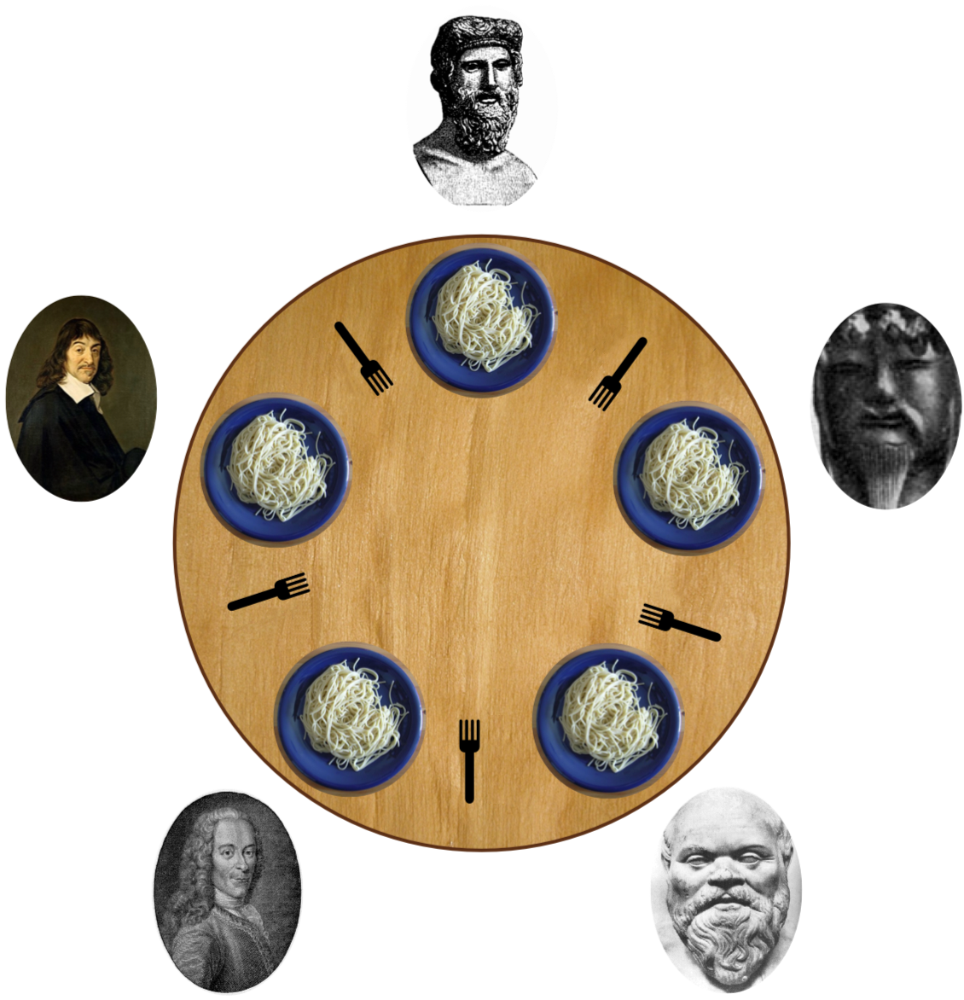

<link href="{{ site.github.url }}/tables.css" rel="stylesheet" />

# The chemical machine paradigm

`Chymyst` adopts an unusual approach to concurrent programming.
This approach does not use threads, actors, futures, or monads.
Instead, concurrent computations are performed by a special runtime engine that simulates chemical reactions.
This approach can be more easily understood by first considering the **chemical machine** metaphor.

## Simulation of chemical reactions

Imagine that we have a large tank of water where many different chemical substances are dissolved.
Different chemical reactions are possible in this “chemical soup”, as various molecules come together and react, producing other molecules.
Reactions could start at the same time (i.e. concurrently) in different regions of the soup.

Chemical reactions are written like this:

HCl + NaOH ⇒ NaCl + H<sub>2</sub>O

A molecule of hydrochloric acid (HCl) reacts with a molecule of sodium hydroxide (NaOH) and yields a molecule of salt (NaCl) and a molecule of water (H<sub>2</sub>O).

Since we are going to simulate reactions in a computer, we make the “chemistry” completely arbitrary.
We can define molecules of any sort, and we can postulate arbitrary reactions between them.

For instance, we can postulate that there exist three sorts of molecules called `a`, `b`, `c`, and that they can react as follows:

`a + b → a`

`a + c →` [_nothing_]


Of course, real-life chemistry does not allow a molecule to disappear without producing any other molecules.
But our chemistry is purely imaginary, and so the programmer is free to postulate arbitrary chemical laws.

To develop the chemical analogy further, we allow the chemical soup to hold many copies of each molecule.
For example, the soup can contain five hundred copies of `a` and three hundred copies of `b`, and so on.
We also assume that we can emit any molecule into the soup at any time.

It is not difficult to implement a simulator for the chemical behavior we just described.
Having specified the list of chemical laws and emitted some initial molecules into the soup, we start the simulation.
The chemical machine will run all the reactions that are allowed by the chemical laws.

We will say that in a reaction such as

`a + b + c → d + e`

the **input molecules** are  `a`, `b`, and `c`, and the **output molecules** are `d` and `e`.
A reaction can have one or more input molecules, and zero or more output molecules.

When a reaction starts, the input molecules instantaneously disappear from the soup (we say they are **consumed** by the reaction), and then the output molecules are **emitted** into the soup.

The simulator will start many reactions concurrently whenever their input molecules are available.
As reactions emit new molecules into the soup, the simulator will continue starting new reactions whenever possible.

## Concurrent computations using the chemical machine

The simulator described in the previous section is at the core of the runtime engine of `Chymyst`.
Rather than merely watch as reactions happen, we are going to use the chemical machine to perform actual computations.
To this end, the following features are added: 

1. Each molecule in the soup is required to _carry a value_.
Molecule values are strongly typed: a molecule of a given sort (such as `a` or `b`) can only carry values of some fixed type (such as `Boolean` or `String`).
The programmer is completely free to specify what kinds of molecules are defined and what types they carry.

2. Since molecules must carry values, we need to specify a value of the correct type whenever we emit a new molecule into the soup.

3. For the same reason, reactions that emit new molecules will need to put values on each of the output molecules.
These output values must be _functions of the input values_, — that is, of the values carried by the input molecules consumed by this reaction.
Therefore, each chemical reaction must carry a Scala expression (called the **reaction body**) that will compute the new output values and emit the output molecules.

With these three additional features, the simple chemical simulator becomes what is called in the academic literature a [“reflexive chemical abstract machine”](http://dl.acm.org/citation.cfm?id=237805).
We will call it, for short, the **chemical machine**.

These three features are essentially a complete description of the chemical machine paradigm.
The rest of this book is a guide to programming the chemical machine.
We will use simple logical reasoning to figure out what reactions are necessary for various concurrent computations. 

## Reactions in pseudo-code

We will use syntax such as `b(123)` to denote molecules.
In a chemical reaction, the syntax `b(123)` means that the molecule `b` carries an integer value `123`.
Molecules to the left-hand side of the arrow are the input molecules of the reaction; molecules on the right-hand side are the output molecules.

A typical reaction, equipped with molecule values and a reaction body, looks like this in pseudo-code syntax:

```
a(x) + b(y) → a(z)
  where z = computeZ(x, y)

```

In this example, the reaction's input molecules are `a(x)` and `b(y)`; that is, the input molecules have chemical designations `a` and `b` and carry values `x` and `y` respectively.

The reaction body is an expression that captures the values `x` and `y` from the consumed input molecules.
The reaction body computes `z` out of `x` and `y`; in this example, this is done using the function `computeZ`.
The newly computed value `z` is placed onto the output molecule `a(z)`, which is emitted back into the soup.

Another example of a reaction is

```
a(x) + c(y) → println(x + y) // reaction body with no output molecules

```

This reaction consumes the molecules `a` and `c` as its input, but does not emit any output molecules.
The only result of running the reaction is the side-effect of printing the number `x + y`.


The computations performed by the chemical machine are _automatically concurrent_:
Whenever input molecules are available in the soup, the runtime engine will start a reaction that consumes these input molecules.
If many copies of input molecules are available, the runtime engine could start several reactions concurrently.
The runtime engine will decide how many concurrent reactions to run, depending on the number of available cores or other considerations.

The reaction body can be a _pure function_ that computes output values solely from the input values carried by the input molecules.
If the reaction body is a pure function, it is completely safe (free of contention or race conditions) to execute concurrently several copies of the same reaction.
Each copy of the reaction will run in its own process, consuming its own set of input molecules and working with its own input values.
This is how the chemical machine achieves safe and automatic concurrency in a purely functional way,
with no shared mutable state.

## The syntax of `Chymyst`

So far, we have been writing chemical laws in pseudo-code.
The actual syntax of `Chymyst` is only a little more verbose.
Reactions are defined using `case` expressions that specify the input molecules by pattern-matching.

Here is the translation of the example reaction shown above into the syntax of `Chymyst`:

```scala
import io.chymyst.jc._

// declare the molecule types
val a = m[Int] // a(...) will be a molecule with an integer value
val b = m[Int] // ditto for b(...)

// declare the reaction site and the available reaction(s)
site(
  go { case a(x) + b(y) ⇒
    val z = computeZ(x,y)
    a(z)
  }
)

```

The helper functions `m`, `site`, and `go` are defined in the `Chymyst` library.

The function `go(...)` defines a reaction.
The left-hand side of a reaction is the set of its input molecules, represented as a pattern-matching expression `case a(x) + ...`.
The values of the input molecules are pattern variables.
The right-hand side of a reaction is an arbitrary Scala expression that can use the pattern variables to compute new values. 

The function call `site(...)` declares a **reaction site**, which can be visualized as a place where molecules gather and wait for their reaction partners.

## Example: Asynchronous counter

We already know enough to start implementing our first concurrent program!

The task at hand is to maintain a counter with an integer value, which can be incremented or decremented by non-blocking (asynchronous) requests.
It should be safe to increment and decrement the counter from different processes running at the same time.

To implement this in `Chymyst`, we begin by deciding which molecules we will need to use.
Since the chemical machine paradigm does not use shared mutable state, it is clear that the integer value of the counter needs to be carried by a molecule.
Let's call this molecule `counter` and specify that it carries an integer value:

```scala
val counter = m[Int]

```

The increment and decrement requests must be represented by other molecules.
Let us call them `incr` and `decr`.
These molecules do not need to carry values, so we will define the `Unit` type as their value type:

```scala
val incr = m[Unit]
val decr = m[Unit]

```

Now we need to define the chemical reactions.
The reactions must be such that the counter's value is incremented when we emit the `incr()` molecule, and decremented when we emit the `decr()` molecule.

So, it looks like we will need two reactions. Let us create a reaction site:

```scala
site(
  go { case counter(n) + incr(_) ⇒ counter(n + 1) },
  go { case counter(n) + decr(_) ⇒ counter(n - 1) }
)

```

Each reaction says that the new value of the counter (either `n + 1` or `n - 1`) will be carried by the new `counter(...)` molecule emitted by the reaction's body.
The previous molecule, `counter(n)`, will be consumed by the reactions.
The `incr()` and `decr()` molecules will be likewise consumed.


In `Chymyst`, a reaction site can declare one or more reactions, since the function `site()` takes a variable number of arguments.

In the present example, however, both reactions need to be written within the same reaction site.
Here is why:

Both reactions `counter + incr → ...` and `counter + decr → ...` consume the molecule `counter()`.
In order for any of these reactions to start, the molecule `counter()` needs to be present at some reaction site.
Therefore, the molecules `incr()` and `decr()` must be present at the _same_ reaction site, or else they cannot meet with `counter()` to start a reaction.
For this reason, both reactions need to be defined _together_ in a single reaction site.

After defining the molecules and their reactions, we can start emitting new molecules into the soup:

```scala
counter(100)
incr() // after a reaction with this, the soup will have counter(101)
decr() // after a reaction with this, the soup will have counter(100)
decr() + decr() // after a reaction with these, the soup will have counter(98)

```

The syntax `decr() + decr()` is just a chemistry-resembling syntactic sugar for emitting several molecules at once.
The expression `decr() + decr()` is equivalent to `decr(); decr()`.

Note that `counter`, `incr` and `decr` are local values that we use as functions, e.g. by writing `counter(100)` and `decr()`, when we need to emit the corresponding molecules.
For this reason, we refer to `counter`, `incr`, and `decr` as **molecule emitters**. 

It could happen that we are emitting `incr()` and `decr()` molecules too quickly for reactions to start.
This will result in many instances of `incr()` or `decr()` molecules being present in the soup, waiting to be consumed.
Is this a problem?

Recall that when the chemical machine starts a reaction, all input molecules are consumed first, and only then the reaction body is evaluated.
In our case, each reaction needs to consume a `counter()` molecule, but only one instance of `counter()` molecule is initially present in the soup.
For this reason, the chemical machine will need to choose whether the single `counter()` molecule will react with an `incr()` or a `decr()` molecule.
Only when the incrementing or the decrementing calculation is finished, the new instance of the `counter()` molecule (with the updated integer value) will be emitted into the soup.
This automatically prevents race conditions with the counter: There is no possibility of updating the counter value simultaneously from different reactions.

## Tracing the output

The code shown above will not print any output, so it is instructive to put some print statements into the reaction bodies.

```scala
import io.chymyst.jc._

// declare the molecule emitters and the value types
val counter = m[Int]
val incr = m[Unit]
val decr = m[Unit]

// helper function to be used in reactions
def printAndEmit(x: Int) = {
  println(s"new value is $x")
  counter(x)
}

// write the reaction site
site(
  go { case counter(n) + decr(_) ⇒ printAndEmit(n - 1) }
  go { case counter(n) + incr(_) ⇒ printAndEmit(n + 1) },
)

counter(100)
incr() // prints “new value is 101”
decr() // prints “new value is 100”
decr() + decr() // prints “new value is 99” and then “new value is 98”

```

## Exercises

### Start a process in the background

Implement a chemical program that starts a separate background thread, evaluating a given function of type `() ⇒ Unit` for side effect.
Starting that thread should be a non-blocking call.

#### Solution

The data consists of a value of type `() ⇒ Unit`. This data must be on a molecule. This molecule must be consumed by a reaction.

```scala

val start = m[() ⇒ Unit]
site(
  go { case start(f) ⇒ f() }
)
// The call to emit `start()` is a non-blocking call.

// Example of usage: 
start { () ⇒ println("Running in background!") }

```

### Producer-consumer

Implement a chemical program that simulates a simple “producer-consumer” arrangement.

There exist one or more items that can be consumed. Each item is labeled by an integer value.
Any process can issue an (asynchronous, concurrent) request to consume an item.
If there is an item available, it should be consumed and its label value printed to the console.
If no items are available, the consume request should wait until items become available.

Initially, there should be `n` items present, labeled by integer values 1 to `n`.

Your code should attempt to consume three items.

The program should define a molecule `item()` carrying an integer value, a molecule `consume()` carrying a unit value, and an appropriate reaction.

(At this point, your chemical program does not need to be able to stop. It is sufficient that the correct values are printed to the console.)

#### Solution

```scala
val item = m[Int]
val consume = m[Unit]
val n = 10 // or `n` could be a runtime parameter
site(
  go { case item(x) + consume(_) ⇒ println(s"consumed $x") }
)
(1 to n).foreach(i ⇒ item(i))

consume() + consume() + consume()

```

### Batch producer

Modify the previous program, adding a request to produce a new set of `n` items, again labeled with values 1 to `n`.

This request should be modeled by a new molecule `produce()` with unit value, and by adding appropriate new reaction(s).

Your code should use the `produce()` request to supply some items _after_ requesting to consume them. Verify that this works!

#### Solution

```scala
val item = m[Int]
val consume = m[Unit]
val produce = m[Unit]
val n = 10
site(
  go { case item(x) + consume(_) ⇒ println(s"consumed $x") },
  go { case produce(_) ⇒ (1 to n).foreach(i ⇒ item(i)) }
)
consume() + consume() + consume()
produce()

```

### Producer with given labels

Modify the previous program, allowing the produce request to specify a list of label values to be put on new items.

This should be modeled by the molecule `produce()` carrying a value of type `List[Int]` with an appropriate reaction.

#### Solution

```scala
val item = m[Int]
val consume = m[Unit]
val produce = m[List[Int]]
val n = 10
site(
  go { case item(x) + consume(_) ⇒ println(s"consumed $x") },
  go { case produce(ls) ⇒ ls.foreach(i ⇒ item(i)) }
)
consume() + consume() + consume()
produce(1 to n)

```

### Take two

Modify the previous program, adding a request to consume 2 items.

This should be modeled by the molecule `consume2()` with `Unit` value.

#### Solution

```scala
val item = m[Int]
val consume = m[Unit]
val consume2 = m[Unit]
val produce = m[List[Int]]
val n = 10
site(
  go { case item(x) + consume(_) ⇒ println(s"consumed $x") },
  go { case produce(ls) ⇒ ls.foreach(i ⇒ item(i)) },
  go { case item(x) + item(y) + consume2(_) ⇒ println(s"consumed $x and $y") }
)
consume() + consume() + consume()
produce(1 to n)
consume2()

```

### Batch consumer

Modify the previous program, adding request to consume `k` items, where `k` is an integer parameter.

This request should be modeled by a new molecule `consumeK()` carrying an integer value, and by adding appropriate new reaction(s).

#### Solution

```scala
val item = m[Int]
val consume = m[Unit]
val consumeK = m[Int]
val produce = m[List[Int]]
val n = 10
site(
  go { case item(x) + consume(_) ⇒ println(s"consumed $x") },
  go { case item(x) + consumeK(k) ⇒
    println(s"item $k consumed: $x")
    if (k > 0) consumeK(k - 1) 
  },
  go { case produce(ls) ⇒ ls.foreach(i ⇒ item(i)) }
)
consume() + consume() + consume()
produce(1 to n)
consumeK(5)

```

## Debugging

`Chymyst` has some debugging facilities to help the programmer verify that the chemistry works as intended.

### Logging the contents of the soup

For debugging purposes, it is useful to see what molecules are currently present in the soup at a given reaction site (RS), waiting to react with other molecules.
This is achieved by calling the `logSite()` method on any of the molecule emitters.
This method will return a string showing the molecules that are currently present in the soup at that RS.
The output will also show the values carried by each molecule.

In our example, all three molecules `counter`, `incr`, and `decr` are declared as inputs at our RS, so we could use any of the emitters, say `decr`, to log the soup contents:

```
> println(decr.logSite)
Site{counter + decr → ...; counter + incr → ...}
Molecules: counter(98)

```

The debug output contains two pieces of information:

- The RS which is being logged: `Site{counter + decr → ...; counter + incr → ...}`
Note that the RS is identified by the reactions that are declared in it.
The reactions are shown in a shorthand notation, which only mentions the input molecules.

- The list of molecules currently waiting in the soup at that RS, namely `Molecules: counter(98)`,
showing that there is presently only one copy of the `counter` molecule, carrying the value `98`.

Also note that the debug output is limited to the molecules that are declared as _input_ at that RS.
We say that these molecules are **bound** to that RS.
The RS will look at the presence or absence of these molecules when it decides which reactions to start.

### Molecule names

A perceptive reader will ask at this point:
How did the program know the names `counter`, `decr`, and `incr` when we called `logSite()`?
These are names of local variables we defined using `val counter = m[Int]` and so on.
Ordinarily, Scala code does not have access to these names.

The magic is actually performed by the method `m`, which is a macro that looks up the name of the enclosing variable.
The same effect can be achieved without macros at the cost of more boilerplate:

```scala
val counter = new M[Int]("counter")
// This is completely equivalent to `val counter = m[Int]`.

```

Molecule names are not checked for uniqueness and have no effect on program execution.
Nevertheless, descriptive names of molecules are very useful for visualizing the reactions, as well as for debugging and logging.
In this book, we will always use macros to define molecules.

## Common errors

### Error: Emitting molecules with undefined chemistry

For each molecule, there must exist a single reaction site (RS) to which this molecule is bound — that is, the RS where this molecule is consumed as input molecule by some reactions.
(See [Reaction Sites](chymyst-core.md#reaction-sites) for a more detailed discussion.)

It is an error to emit a molecule that is not yet defined as input molecule at any RS (i.e. not yet bound to any RS).

```scala
val x = m[Int]
x(100)
// java.lang.Exception: Molecule x is not bound to any reaction site, cannot emit

```

The same error will occur if the emitter call is attempted inside a reaction body, or if we call `logSite()` on the molecule emitter.

The correct way of using `Chymyst` is first to define molecules, then to create a RS where these molecules are used as inputs for reactions, and only then to start emitting these molecules.

The method `isBound` can be used to determine at run time whether a molecule has been already bound to a RS:

```scala
val x = m[Int]

x.isBound // returns `false`

site( go { case x(2) ⇒ } )

x.isBound // returns `true`

```

### Error: Redefining chemistry

Chemical laws are immutable in a `Chymyst` program.
All reactions that consume a certain molecule must be declared in one reaction site.
Once it is declared that a certain molecule starts certain reactions, users cannot add new reactions that consume that molecule.

For this reason, it is an error to write a reaction whose input molecule is already _used as input_ at another reaction site.

```scala
val x = m[Int]
val a = m[Unit]
val b = m[Unit]

site( go { case x(n) + a(_) ⇒ println(s"got x($n) + a") } ) // OK, `x` is now bound to this RS.

site( go { case x(n) + b(_) ⇒ println(s"got x($n) + b") } )
// java.lang.Exception: Molecule x cannot be used as input in
// Site{b + x → ...} since it is already bound to Site{a + x → ...}

```

This program contradicts the intended meaning of reaction sites, namely that molecules arrive there to wait for their reaction partners.
If we define two RSs as above and then emit `x(123)`, the molecule `x(123)` must go to the first RS if it is to react with `a()` and to the second RS if it is to react with `b()`.
There is no single RS where `x()` could wait for both of its possible reaction partners, but `x()` cannot be present at two reaction sites at the same time! 

What the programmer probably meant is simply that the molecule `x()` has two different reactions that consume it.
Correct use of `Chymyst` requires that we put these two reactions together into _one_ reaction site:
 
```scala
val x = m[Int]
val a = m[Unit]
val b = m[Unit]

site(
  go { case x(n) + a(_) ⇒ println(s"got x($n) + a") },
  go { case x(n) + b(_) ⇒ println(s"got x($n) + b") }
) // OK, this works.

``` 

More generally, all reactions that share any input molecules must be defined together in a single RS.
Whenever a molecule is consumed by a reaction at some RS, we say that this molecule is **bound** to that RS.
Any reactions consuming that molecule must be defined at the same RS.

However, reactions that use that molecule only as _output_ may be declared in another RS.
Here is an example where we define a reaction that computes a result and emits a molecule called `show`, which is bound to another RS:

```scala
val show = m[Int]
// reaction site where the “show” molecule is an input molecule
site( go { case show(x) ⇒ println(s"got $x") })

val start = m[Unit]
// reaction site where the “show” molecule is an output molecule
// (but not an input molecule)
site(
  go { case start(_) ⇒ val res = compute(???); show(res) }
)

``` 

## Order of reactions and indeterminism

When a reaction site has sufficiently many waiting molecules that several different reactions could start,
the runtime engine will make a choice as to which reaction will actually be scheduled to start.

The next figure shows an example where the soup initially contains one copy of the `counter()` molecule, one copy of `incr()`, and one copy of `decr()`.
The `counter` molecule could either react with the `incr()` molecule or with the `decr()` molecule.
One of these reactions (shown in solid lines) have been chosen to actually start, which leaves the second reaction (shown in dashed lines) without the input molecule `counter()`.
Therefore, the second reaction cannot start now.


Similarly, when there are several copies of the _same_ molecule that can be consumed by a reaction, the runtime engine will make a choice of which copy of the molecule to consume.

The next figure shows an example where the soup contains one copy of the `counter()` molecule and four copies of the `incr()` molecule.
Each of the four `incr()` molecules can react with the one `counter()` molecule.
The runtime engine is going to choose the molecules that will actually react.
One reaction (shown in solid lines) will start, consuming the `counter()` and `incr()` molecules, while other possible reactions (some of them shown in dashed lines) will not start.


After this reaction, the soup will contain one copy of the `counter()` molecule (with the updated value) and the three remaining `incr()` molecules.
At the next step, another one of the `incr()` molecules will be chosen to start a reaction, as shown in the next figure:


`Chymyst` does _not_ randomize the order of input molecules or the order of reactions but makes an implementation-dependent choice, designed to optimize the performance of the reaction scheduler.

It is important to keep in mind that we _cannot_ assign priorities to reactions or to input molecules.
The chemical machine ignores the order in which reactions are listed in the `site(...)` call, as well as the order of molecules in the input list of each reaction.
Within debugging messages, input molecules are printed in the alphabetical order of names, output molecules are printed in the order emitted,
and reactions are printed in an unspecified but fixed order.

To summarize: When there are sufficiently many waiting molecules so that several different reactions could start, the order in which reactions will start is non-deterministic and unknown.

Concurrent programs usually expect a certain degree of indeterminism during execution.
For example, the partial computations for a parallel map/reduce operation should be executed in the order that best fits the run-time conditions, rather than in any fixed order.
The important requirement is that the final result should be deterministic.

If obtaining a deterministic final result in a particular application requires to maintain a fixed order for certain reactions,
it is the programmer's task to design the chemistry in such a way that those reactions start in the desired order.
This is always achievable by using appropriate auxiliary molecules and/or guard conditions.

In fact, a facility for assigning explicit priority ordering to molecules or reactions would be counterproductive!
It will only give the programmer _an illusion of control_ over the order of reactions, while actually introducing subtle non-deterministic behavior.

To illustrate this by example, suppose we would like to compute the sum of a bunch of numbers, where the numbers arrive concurrently at unknown times.
In other words, we expect to receive many molecules `data(x)` with integer values `x`,
and we need to compute and print the final sum value when no more `data(...)` molecules are present.

Here is an (incorrect) attempt to design the chemistry for this program:

```scala
// Non-working code!
val data = m[Int]
val sum = m[Int]
site (
// We really want the first reaction to be high priority...
  go { case data(x) + sum(y) ⇒ sum(x + y) },
// ...and run the second one only after all `data` molecules are gone.
  go { case sum(x) ⇒ println(s"sum = $x") }
)
data(5) + data(10) + data(150)
sum(0) // expect "sum = 165"

```

Our intention is to run only the first reaction and to ignore the second reaction as long as `data(...)` molecules are available in the soup.
The chemical machine does not actually allow us to assign priorities to reactions.
But, if we were able to assign a higher priority to the first reaction, what would be the result?

In reality, the `data(...)` molecules are going to be emitted at unpredictable times.
For instance, they could be emitted by several other reactions that are running concurrently.
Then it will sometimes happen that the `data(...)` molecules are emitted more slowly than we are consuming them at our reaction site.
When that happens, there will be a brief interval of time when no `data(...)` molecules are present in the soup (although other reactions are perhaps about to emit some more of them).
The chemical machine will then run the second reaction, consume the `sum(...)` molecule, and print the result, signalling (incorrectly) that the computation is finished.
Perhaps this failure will _rarely_ happen and will not be detected by unit tests, but at some point it is definitely going to happen in production code.
This kind of indeterminism illustrates why concurrency is widely regarded as a hard programming problem.

`Chymyst` will actually reject our attempted program and print an error message before running anything, immediately after we define the reaction site:

```scala
val data = m[Int]
val sum = m[Int]
site (
  go { case data(x) + sum(y) ⇒ sum(x + y) },
  go { case sum(x) ⇒ println(s"sum = $x") }
)

```
`Exception: In Site{data + sum → ...; sum → ...}: Unavoidable indeterminism:`
`reaction {data + sum → } is shadowed by {sum → }`

The error message means that the reaction `sum → ...` may prevent `data + sum → ...` from running,
and that the programmer _has no control_ over this indeterminism.

What we need here is to keep track of how many `data(...)` molecules we already consumed,
and to print the final result only when we reach the total expected number of the `data(...)` molecules.
Let us see how to implement this.

Since reactions do not hold any mutable state, the information about the remaining `data(...)` molecules has to be carried on the `sum(...)` molecule.
So, we will define the `sum(...)` molecule with type `(Int, Int)`, where the second integer will be the number of `data(...)` molecules that remain to be consumed.

The reaction `data + sum` should proceed only when we know that some `data(...)` molecules are still remaining.
Otherwise, the `sum(...)` molecule should start its own reaction and print the final result. 

```scala
val data = m[Int]
val sum = m[(Int, Int)]
site (
  go { case data(x) + sum((y, remaining)) if remaining > 0 ⇒
    sum((x + y, remaining - 1))
  },
  go { case sum((x, 0)) ⇒ println(s"sum = $x") }
)
data(5) + data(10) + data(150) // emit three `data` molecules
sum((0, 3)) // "sum = 165" printed

```

Now the chemistry is correct; there is no need to assign priorities to reactions.

The chemical machine paradigm forces the programmer to design the chemistry in such a way that
the order of running reactions is controlled by the data on the available molecules.

Another way of maintaining determinism when it is needed is to avoid writing reactions that might shadow each other's input molecules.
Here is equivalent code with just one reaction:

```scala
val data = m[Int]
val sum = m[(Int, Int)]
site (
  go { case data(x) + sum((y, remaining)) ⇒
      val newSum = x + y
      if (remaining == 1)  println(s"sum = $newSum")
      else  sum((newSum, remaining - 1)) 
     }
)
data(5) + data(10) + data(150) // emit three `data` molecules
sum((0, 3)) // expect "sum = 165" printed

```

The drawback of this approach is that the chemistry became less declarative due to complicated branching code inside the reaction body.
However, the program will run somewhat faster because no guard conditions need to be checked before scheduling a reaction,
and thus the scheduler does not need to search for molecule values that satisfy the guard conditions.

If the run-time overhead of scheduling a reaction is insignificant compared with the computations inside reactions, the programmer may prefer to use a more declarative code style.

## Summary so far

A chemical program consists of the following descriptions:

- the defined molecules, together with their value types;
- the reactions involving these molecules as inputs, together with reaction bodies;
- code that emits some molecules at the initial time.

These definitions comprise the “chemistry” of a concurrent program.

The user can define one or more reaction sites, each having one or more reactions.
We imagine a reaction site to be a virtual place where molecules arrive and wait for other molecules, in order to start reactions with them. 
Each molecule has only one reaction site where that molecule can be consumed by reactions.

For this reason, all reactions that have a common _input_ molecule must be declared at the same reaction site.
Different reaction sites may not have any common input molecules.

By defining molecules, reaction sites, and the reactions at each site, we can specify an arbitrarily complicated system of interacting concurrent processes. 

After defining the molecules and specifying the reactions, the code will typically emit some initial molecules into the soup.
The chemical machine will then start running all the possible reactions, constantly keeping track of the molecules consumed by reactions or newly emitted into the soup.

Let us recapitulate the core ideas of the chemical paradigm of concurrency:

- In the chemical machine, there is no shared mutable state; all data is immutable and must be carried by some molecules.
- Each reaction specifies its input molecules, and in this way determines all the data necessary for computing the reaction body.
The chemical machine will automatically make this data available to a reaction, since the reaction can start only when all its input molecules are present in the soup.
- A reaction body is a Scala expression that evaluates to `Any`. (The final result value of that expression is discarded.)
The reaction body can perform arbitrary computations using the input molecule values or other values visible in the local scope.
- The reaction body will typically compute some new values and emit new molecules carrying these values.
Emitting a molecule is a side effect of calling an emitter.
Emitters can be called at any time — either within a reaction body or in any other code.
- Up to the side effect of emitting new molecules, the reaction body can be a pure function that only depends on the input data of the reaction.
In this case, many copies of the reaction can be safely executed concurrently when many sets of input molecules are available.
Also, the reaction can be safely and automatically restarted in the case of a transient failure
by simply emitting the input molecules again.

The chemical laws specify declaratively all the computations available for the data carried by the given molecules.
Whenever multiple sets of data are available, the corresponding computations may be performed concurrently;
this is decided automatically by the chemical machine.

# Example: Declarative solution for “dining philosophers”

The [“dining philosophers problem”](https://en.wikipedia.org/wiki/Dining_philosophers_problem) is to run a simulation of five philosophers who take turns eating and thinking.
Each philosopher needs two forks to start eating, and every pair of neighbor philosophers shares a fork.



The simplest solution of the “dining philosophers” problem in the chemical machine paradigm
is achieved using a molecule for each fork and two molecules per philosopher: one representing a thinking philosopher and the other representing a hungry philosopher.

- Each of the five “thinking philosopher” molecules (`thinking1`, `thinking2`, ..., `thinking5`) starts a reaction in which the process is paused for a random time and then the “hungry philosopher” molecule is emitted.
- Each of the five “hungry philosopher” molecules (`hungry1`, ..., `hungry5`) needs to react with _two_ neighbor “fork” molecules.
The reaction process is paused for a random time, and then the “thinking philosopher” molecule is emitted together with the two “fork” molecules previously consumed.

The complete code is shown here:

```scala
import io.chymyst.jc._

 /** Print message and wait for a random time interval. */
def wait(message: String): Unit = {
  println(message)
  Thread.sleep(scala.util.Random.nextInt(20))
}

val hungry1 = m[Unit]
val hungry2 = m[Unit]
val hungry3 = m[Unit]
val hungry4 = m[Unit]
val hungry5 = m[Unit]
val thinking1 = m[Unit]
val thinking2 = m[Unit]
val thinking3 = m[Unit]
val thinking4 = m[Unit]
val thinking5 = m[Unit]
val fork12 = m[Unit]
val fork23 = m[Unit]
val fork34 = m[Unit]
val fork45 = m[Unit]
val fork51 = m[Unit]

site (
  go { case thinking1(_) ⇒ wait("Socrates is thinking");  hungry1() },
  go { case thinking2(_) ⇒ wait("Confucius is thinking"); hungry2() },
  go { case thinking3(_) ⇒ wait("Plato is thinking");     hungry3() },
  go { case thinking4(_) ⇒ wait("Descartes is thinking"); hungry4() },
  go { case thinking5(_) ⇒ wait("Voltaire is thinking");  hungry5() },

  go { case hungry1(_) + fork12(_) + fork51(_) ⇒ wait("Socrates is eating");  thinking1() + fork12() + fork51() },
  go { case hungry2(_) + fork23(_) + fork12(_) ⇒ wait("Confucius is eating"); thinking2() + fork23() + fork12() },
  go { case hungry3(_) + fork34(_) + fork23(_) ⇒ wait("Plato is eating");     thinking3() + fork34() + fork23() },
  go { case hungry4(_) + fork45(_) + fork34(_) ⇒ wait("Descartes is eating"); thinking4() + fork45() + fork34() },
  go { case hungry5(_) + fork51(_) + fork45(_) ⇒ wait("Voltaire is eating");  thinking5() + fork51() + fork45() }
)
// Emit molecules representing the initial state:
thinking1() + thinking2() + thinking3() + thinking4() + thinking5()
fork12() + fork23() + fork34() + fork45() + fork51()
// Now reactions will start and print messages to the console.

```

Note that a `hungry + fork + fork` reaction will consume a “hungry philosopher” molecule and two “fork” molecules,
so these three molecules will not be present in the soup during the time interval taken by the “eating” process.
Thus, neighbor philosophers will not be able to start eating until the two “fork” molecules are returned to the soup.
Which philosophers start eating will be decided randomly, but there will never be a deadlock.

The example code shown above is _fully declarative_: it describes what the “dining philosophers” simulation must do but not how to do it,
and the code is quite close to the English-language description of the problem.

The result of running this program is the output such as

```
Plato is thinking
Socrates is thinking
Voltaire is thinking
Descartes is thinking
Confucius is thinking
Plato is eating
Socrates is eating
Plato is thinking
Descartes is eating
Socrates is thinking
Voltaire is eating
Descartes is thinking
Confucius is eating
Voltaire is thinking
Plato is eating
Confucius is thinking
Socrates is eating
Socrates is thinking
Plato is thinking
Voltaire is eating

```
