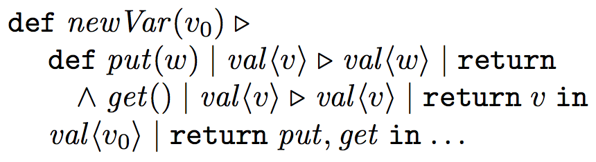

<link href="{{ site.github.url }}/tables.css" rel="stylesheet" />

# Previous work

Here are some previous implementations of Join Calculus that I was able to find.

- The `Funnel` programming language: [M. Odersky et al., 2000](http://lampwww.epfl.ch/funnel/). This project was discontinued.
- _Join Java_: [von Itzstein et al., 2001-2005](http://www.vonitzstein.com/Project_JoinJava.html). This was a modified Java language compiler, with support for certain Join Calculus constructions. The project is not maintained.
- The `JoCaml` language: [Official site](http://jocaml.inria.fr) and a publication about JoCaml: [Fournet et al. 2003](http://research.microsoft.com/en-us/um/people/fournet/papers/jocaml-afp4-summer-school-02.pdf). This is a dialect of OCaml implemented as a patch to the OCaml compiler. The project is still supported.
- “Join in Scala” compiler patch: [V. Cremet 2003](http://lampwww.epfl.ch/~cremet/misc/join_in_scala/index.html). The project is discontinued.
- Joins library for .NET: [P. Crusso 2006](http://research.microsoft.com/en-us/um/people/crusso/joins/). The project is available as a .NET binary download from Microsoft Research.
- `ScalaJoins`, a prototype implementation in Scala: [P. Haller 2008](http://lampwww.epfl.ch/~phaller/joins/index.html). The project is not maintained.
- `ScalaJoin`: an improvement over `ScalaJoins`, [J. He 2011](https://github.com/Jiansen/ScalaJoin). The project is not maintained.
- Joinads, a not-quite-Join-Calculus implementation in F# and Haskell: [Petricek and Syme 2011](https://www.microsoft.com/en-us/research/publication/joinads-a-retargetable-control-flow-construct-for-reactive-parallel-and-concurrent-programming/). The project is not maintained.
- Proof-of-concept implementations of Join Calculus for iOS: [CocoaJoin](https://github.com/winitzki/AndroJoin) and Android: [AndroJoin](https://github.com/winitzki/AndroJoin). These projects are not maintained.

The implementation of JC in `Chymyst` is based on ideas from Jiansen He's `ScalaJoin` as well as on CocoaJoin / AndroJoin.

## Improvements with respect to Jiansen He's `ScalaJoin`

Compared to [`ScalaJoin` (Jiansen He's 2011 implementation of JC)](https://github.com/Jiansen/ScalaJoin), `Chymyst Core` offers the following improvements:

- Lighter syntax for reaction sites (join definitions). Compare:

`Chymyst Core`:

```scala
val a = m[Int]
val c = b[Int, Int]
site(
  go { case a(x) + c(y, reply) =>
    a(x+y)
    reply(x)
  }
)
a(1)

```

`ScalaJoin`:

```scala
object join1 extends Join {
  object a extends AsyName[Int]
  object c extends SynName[Int, Int]

  join {
    case a(x) and c(y) =>
      a(x+y)
      c.reply(x)
  }
}
a(1)

```

- Molecule emitters (“channel names”) are not singleton objects as in `ScalaJoin` but locally scoped values. This is how the semantics of JC is implemented in JoCaml. In this way, we get more flexibility in defining molecules.
- Reactions are not merely `case` clauses but locally scoped values (instances of class `Reaction`). `Chymyst` uses macros to perform some static analysis of reactions at compile time and detect some errors.
- Reaction sites are not explicit objects but are local values(instances of class `ReactionSite`) and are invisible to the user, as they should be according to the semantics of JC.

## Improvements with respect to JoCaml


As a baseline reference, the most concise syntax for JC is available in [JoCaml](http://jocaml.inria.fr), which uses a modified OCaml compiler:

```ocaml
def a(x) & c(y) =  
   a(x+y) & reply x to c
spawn a(1)

```

In the JoCaml syntax, `a` and `c` are declared implicitly, together with the reaction.
Implicit declaration of molecule emitters (“channels”) is not possible in `Chymyst` because Scala macros do not allow us to insert a new top-level name declaration into the code.
So, declarations need to be explicit and show the types of values (`b[Int, Int]` and so on).
Other than that, `Chymyst`'s syntax is closely modeled on that of `ScalaJoin` and JoCaml.


# Other tutorials on Join Calculus

The present “chemical machine” tutorial is a non-theoretical introduction to Join Calculus for programmers.

This tutorial is based on my [earlier tutorial for JoCaml](https://sites.google.com/site/winitzki/tutorial-on-join-calculus-and-its-implementation-in-ocaml-jocaml). (However, be warned that the JoCaml tutorial is unfinished and probably contains some mistakes in some of the more advanced code examples.)

See also [my recent presentation at _Scala by the Bay 2016_](https://scalaebythebay2016.sched.org/event/7iU2/concurrent-join-calculus-in-scala).
([Talk slides are available](https://github.com/winitzki/talks/tree/master/join_calculus)).
That presentation covered an early version of `Chymyst`.

There are a few academic papers on Join Calculus and a few expository descriptions, such as the Wikipedia article or the JoCaml documentation.
Unfortunately, I cannot recommend reading them because they are unsuitable for learning about the chemical machine / Join Calculus paradigm.

I learned about the “Reflexive Chemical Abstract Machine” from the introduction in one of the [early papers on Join Calculus](http://citeseerx.ist.psu.edu/viewdoc/download?doi=10.1.1.32.3078&rep=rep1&type=pdf).

Do not start by reading academic papers if you never studied Join Calculus - you will be unnecessarily confused, because those texts are not pedagogical but intended for advanced computer scientists.

As another comparison, here is some code in academic Join Calculus, taken from [this tutorial](http://research.microsoft.com/en-us/um/people/fournet/papers/join-tutorial.pdf):



This code creates a shared value container `val` with synchronized single access.

The equivalent `Chymyst` code looks like this:

```scala
def newVar[T](v0: T): (B[T, Unit], B[Unit, T]) = {
  val put = b[T, Unit] 
  val get = b[Unit, T]
  val _val = m[T] // have to use `_val` since `val` is a Scala keyword
  
  site(
    go { case put(w, ret) + _val(v) => _val(w); ret() },
    go { case get(_, ret) + _val(v) => _val(v); ret(v) }
  )
  _val(v0)
  
  (put, get)
}

```

I also do not recommend reading the [Wikipedia page on Join Calculus](https://en.wikipedia.org/wiki/Join-calculus).
As of December 2016, this page says this about Join Calculus:

> The join-calculus ... can be considered, at its core, an asynchronous π-calculus with several strong restrictions:
>
> - Scope restriction, reception, and replicated reception are syntactically merged into a single construct, the _definition_;
> - Communication occurs only on defined names;
> - For every defined name there is exactly one replicated reception.
>
> However, as a language for programming, the join-calculus offers at least one convenience over the π-calculus — namely the use of multi-way join patterns, the ability to match against messages from multiple channels simultaneously.

This text is impossible to understand unless you are already well-versed in the research literature.
(I'm not sure what it means to have “communication on _defined_ names”, as opposed to communication on _undefined_ names...)

Academic literature on Join Calculus typically uses terms such as “channel” and “message”, which are not helpful for understanding how to write concurrent programs in JC.
Indeed, a “channel” in JC holds an _unordered_ collection of messages, rather than an ordered queue or mailbox, as the word “channel” suggests.
The word “message” again suggests that somewhere a mailbox receives messages one by one.
This is very different from what happens in JC, where a reaction waits on several “messages” at once, and different reactions can contend on “messages”.

Instead of using academic terminology, I always follow the chemical machine metaphor and terminology when talking about `Chymyst` programming.
Here is a dictionary:

| Chemical machine  | Academic Join Calculus | `Chymyst` code |
|---|---|---|
| input molecule | message on channel | `case a(123) => ...` _// pattern-matching_ |
| molecule emitter | channel name | `val a :  M[Int]` |
| blocking emitter | synchronous channel | `val q :  B[Unit, Int]` |
| reaction | process | `val r1 = go { case a(x) + ... => ... }` |
| emitting an output molecule | sending a message | `a(123)` _// side effect_ |
| emitting a blocking molecule | sending a synchronous message | `q()` _// returns Int_ |
| reaction site | join definition | `site(r1, r2, ...)` |

